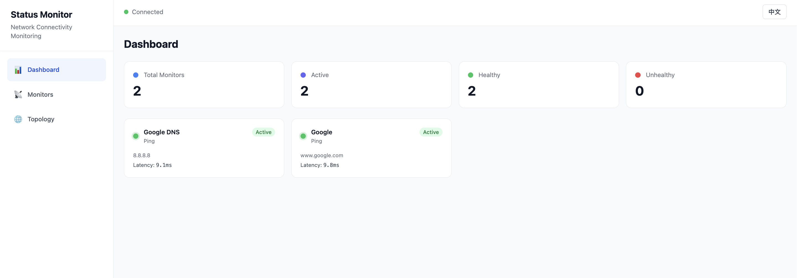

# Status Monitor | 网络状态监控

A self-hosted network connectivity monitor with **real-time traceroute path visualization**, animated topology mapping, and multi-protocol health checks.

自托管的网络连通性监控工具，具备**实时 Traceroute 路径可视化**、动态拓扑映射和多协议健康检测能力。

---

## Comparison with Existing Tools | 与现有工具对比

Status Monitor focuses on **network path-level diagnostics** rather than just uptime tracking. Below is an honest comparison with popular open-source alternatives.

Status Monitor 侧重于**网络路径级别的诊断**，而不仅仅是可用性追踪。以下是和主流开源方案的客观对比。

| Feature | Status Monitor | Uptime Kuma | Statping |
|---------|---------------|-------------|----------|
| Traceroute path visualization | ✅ Animated hop-by-hop | ❌ | ❌ |
| Network topology mapping | ✅ Auto + Manual | ❌ | ❌ |
| Hop-level latency breakdown | ✅ Per-hop color coding | ❌ | ❌ |
| Animated packet flow | ✅ Real-time SVG animation | ❌ | ❌ |
| Multi-protocol (ICMP/HTTP/TCP/DNS) | ✅ | ✅ | ✅ |
| Real-time WebSocket updates | ✅ No refresh | ✅ | Partial |
| Bilingual UI (EN/ZH) | ✅ Built-in | ❌ | ❌ |
| Single-container deploy | ✅ SQLite, zero config | ✅ | ✅ |
| Status page / public page | ❌ | ✅ | ✅ |
| Notification (Telegram/Email/Discord/Slack) | ❌ | ✅ | ✅ |
| Multi-user & authentication | ❌ | ✅ | Partial |
| Certificate expiry monitoring | ❌ | ✅ | ✅ |
| Keyword / HTTP body check | ❌ | ✅ | Partial |
| Prometheus metrics export | ❌ | ✅ | ✅ |
| Maintenance window scheduling | ❌ | ✅ | ❌ |
| Plugin / API key system | ❌ | Partial | ❌ |

**TL;DR**: If you need status pages, rich notifications, multi-user access, or SSL monitoring — Uptime Kuma is the more mature choice. If you want to **see the full network path to your target**, understand **which hop is causing latency**, and visualize your network topology — that's where Status Monitor shines.

**总结**：如果你需要状态页、丰富的通知渠道、多用户权限或证书监控——Uptime Kuma 是更成熟的选择。如果你想要**看到到目标的完整网络路径**，理解**哪一跳导致了延迟**，并且可视化你的网络拓扑——这正是 Status Monitor 的专长。

---

## Screenshots | 效果预览

### Dashboard — Live monitoring overview | 仪表盘 — 实时监控概览



Monitor status at a glance with color-coded latency, uptime percentage, and responsive time-series charts. All data updates in real time via WebSocket — no manual refresh needed.

一目了然的监控状态，颜色编码的延迟指示、在线率统计和响应式时间序列图表。数据通过 WebSocket 实时推送，无需手动刷新。

### Monitor Details — Per-target deep dive | 监控详情 — 单目标深度分析


Drill into any monitor to see detailed check history, latency trends, and downtime records. Each result includes status code, response time, and error details.

点击任意监控项查看详细的检测历史、延迟趋势和停机记录。每条结果包含状态码、响应时间和错误详情。

### Traceroute Topology — Visual network path | Traceroute 拓扑 — 可视化网络路径


The signature feature. Run a traceroute to any target and watch the network path unfold in real time — each hop is auto-classified (Gateway / LAN / Transit / ISP / Target) with animated packet flow showing live traffic. Failed hops are highlighted in red so you can instantly spot where connectivity breaks.

核心特性。对任意目标执行 Traceroute，实时观看网络路径逐步展开——每一跳自动分类（网关 / 局域网 / 骨干网 / ISP / 目标），并带有动态数据包流动动画。失败的跳点以红色高亮，让你一眼定位连通性中断的位置。

---

## Highlights | 核心特性

- **Route Trace (Traceroute)** — Visualize the full network path hop-by-hop with real-time animated packet flow. Each hop shows IP, hostname, latency bar, and auto-detected node type. Failed hops are highlighted in red. / 逐跳可视化完整网络路径，带有实时数据包流动动画。每一跳显示 IP、主机名、延迟条和自动检测的节点类型。
- **Multi-Protocol Monitoring** — ICMP Ping, HTTP(S), TCP Port, and DNS checks with configurable intervals and timeouts. Latency is color-coded (green <10ms, yellow <50ms, orange <100ms, red 100ms+). / 支持 ICMP Ping、HTTP(S)、TCP 端口和 DNS 检测，可配置间隔和超时。延迟按颜色编码（绿色 <10ms、黄色 <50ms、橙色 <100ms、红色 100ms+）。
- **Live Topology Editor** — Two modes: auto-discover via traceroute, or manually build a network diagram with drag-and-drop nodes and links. Each link animates to show live traffic flow. / 两种模式：通过 Traceroute 自动发现，或手动拖拽节点和连线构建网络图。每条连线带有动态流量动画。
- **Real-Time Dashboard** — WebSocket-powered updates with no page refresh. Status changes and latency results stream instantly. / 基于 WebSocket 的实时更新，无需刷新页面。状态变更和延迟结果即时推送。
- **Bilingual UI** — Full Chinese/English support with one-click language switching. / 完整的中英文双语支持，一键切换语言。
- **Cloud-Ready Deployment** — Docker/Podman multi-stage build, Kubernetes manifests with HPA and Ingress, plus a Helm chart. / 支持 Docker/Podman 多阶段构建、Kubernetes 清单（含 HPA 和 Ingress）以及 Helm Chart。

---

## Quick Start | 快速开始

### Development | 开发模式

**Backend** (using conda | 使用 conda):
```bash
cd backend
conda create -n status-monitor python=3.11 -y
conda activate status-monitor
pip install -r requirements.txt
python run.py
```

**Frontend**:
```bash
cd frontend
npm install
npm run dev
```

Open http://localhost:5173 (proxies API to backend on :8000) | 打开 http://localhost:5173（API 自动代理到后端 :8000）

### Production (Podman/Docker) | 生产环境

```bash
cd deploy/docker
podman compose up --build
# or | 或
docker compose up --build
```

### Kubernetes

```bash
# Raw manifests | 原始清单
kubectl apply -f deploy/k8s/

# Helm
helm install status-monitor helm/status-monitor/
```

---

## API

All endpoints under `/api/v1/` | 所有接口前缀为 `/api/v1/`：

| Method | Endpoint | Description | 说明 |
|--------|----------|-------------|------|
| GET/POST | /monitors | List/Create monitors | 列出/创建监控项 |
| GET/PUT/DELETE | /monitors/{id} | Read/Update/Delete monitor | 读取/更新/删除监控项 |
| POST | /monitors/{id}/check | Trigger immediate check | 触发即时检测 |
| GET | /results/monitor/{id} | Paginated check results | 分页检测结果 |
| GET | /results/monitor/{id}/stats | Aggregated statistics | 聚合统计 |
| GET | /results/latest-all | Latest result for all monitors | 所有监控项最新结果 |
| GET/POST | /topology/nodes | List/Create topology nodes | 列出/创建拓扑节点 |
| GET/POST | /topology/links | List/Create topology links | 列出/创建拓扑连线 |
| GET | /topology/graph | Full graph for visualization | 完整拓扑图数据 |
| POST | /traceroute/run | Start async traceroute | 启动异步 Traceroute |
| GET | /traceroute/runs/{id} | Get run with all hops | 获取运行记录及所有跳点 |
| GET | /traceroute/runs/{id}/topology | Hops as React Flow graph | 跳点数据转为拓扑图格式 |
| WS | /ws | Real-time updates | 实时更新推送 |

Swagger UI available at http://localhost:8000/docs | Swagger 文档地址：http://localhost:8000/docs

---

## Architecture | 技术架构

```
Frontend (React + TypeScript + Vite)
  → React Flow for topology / 拓扑可视化
  → Recharts for live charts / 实时图表
  → Zustand for state / 状态管理
  → i18next for bilingual / 国际化
  → Framer Motion for animations / 动画效果

Backend (Python + FastAPI)
  → SQLAlchemy async + SQLite / 异步 ORM + SQLite
  → APScheduler for monitoring jobs / 定时任务调度
  → WebSocket for real-time broadcast / 实时广播
  → asyncio subprocess for traceroute/ping / 异步子进程执行
  → Reverse DNS resolution for hop hostnames / 反向 DNS 解析
```

---

## Environment Variables | 环境变量

| Variable | Default | Description | 说明 |
|----------|---------|-------------|------|
| SM_DEBUG | false | Enable debug mode | 启用调试模式 |
| SM_HOST | 0.0.0.0 | Server bind address | 服务绑定地址 |
| SM_PORT | 8000 | Server port | 服务端口 |
| SM_DATA_DIR | ./data | SQLite database directory | SQLite 数据库目录 |
| SM_DATABASE_URL | (auto) | Override database URL | 覆盖数据库连接地址 |
| SM_CORS_ORIGINS | * | Comma-separated allowed origins (set explicit origins to enable credentials) | 允许的跨域来源，逗号分隔（设为具体来源才会启用 credentials） |
| SM_RETENTION_DAYS | 30 | Days of check results / traceroute runs to keep (0 = keep forever) | 保留多少天的检测结果 / Traceroute 记录（0 = 永久保留） |

---

## License
