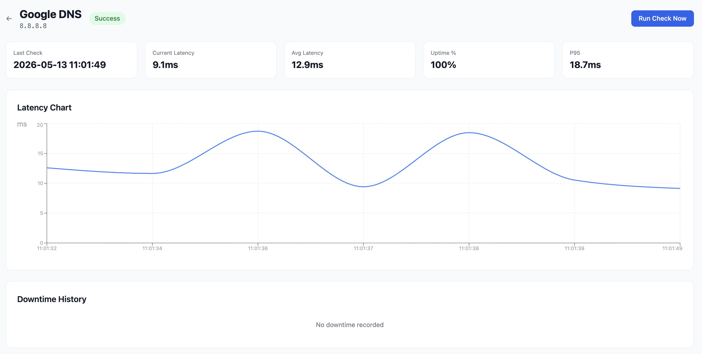
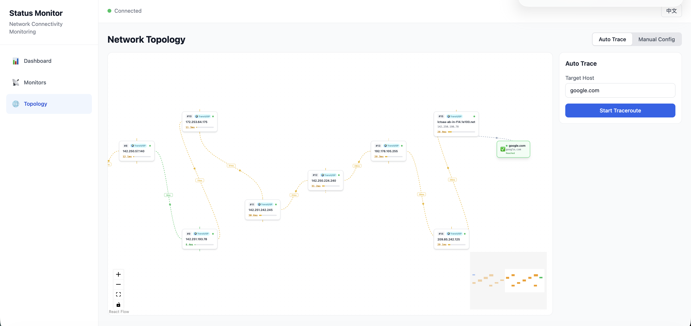

# Status Monitor | 网络状态监控

A self-hosted network connectivity monitor with **real-time traceroute path visualization**, animated topology mapping, and multi-protocol health checks.

自托管的网络连通性监控工具，具备**实时 Traceroute 路径可视化**、动态拓扑映射和多协议健康检测能力。

---

## Why Not Uptime Kuma / Statping? | 与现有监控工具的区别

Most online status monitors (Uptime Kuma, Statping, Instatus, etc.) tell you **whether** a target is up or down. Status Monitor goes deeper — it shows you **why** and **where** the problem is, by visualizing the full network path hop-by-hop in real time.

主流的状态监控工具（Uptime Kuma、Statping 等）只告诉你目标**是否在线**。Status Monitor 走得更远——它通过逐跳可视化完整网络路径，帮你定位**哪里出了问题**、**为什么出问题**。

| Feature | Status Monitor | Uptime Kuma | Statping |
|---------|---------------|-------------|----------|
| Traceroute path visualization | ✅ Animated hop-by-hop | ❌ | ❌ |
| Network topology mapping | ✅ Auto + Manual | ❌ | ❌ |
| Hop-level latency breakdown | ✅ Per-hop color coding | ❌ | ❌ |
| Animated packet flow | ✅ Real-time SVG animation | ❌ | ❌ |
| Multi-protocol (ICMP/HTTP/TCP/DNS) | ✅ | ✅ | ✅ |
| Real-time WebSocket updates | ✅ No refresh | ✅ | Partial |
| Bilingual UI (EN/ZH) | ✅ Built-in | ❌ | ❌ |
| Single-container deploy | ✅ SQLite, zero config | ✅ | ✅ |

---

## Screenshots | 效果预览

### Dashboard — Live monitoring overview | 仪表盘 — 实时监控概览


Monitor status at a glance with color-coded latency, uptime percentage, and responsive time-series charts. All data updates in real time via WebSocket — no manual refresh needed.

一目了然的监控状态，颜色编码的延迟指示、在线率统计和响应式时间序列图表。数据通过 WebSocket 实时推送，无需手动刷新。

### Monitor Details — Per-target deep dive | 监控详情 — 单目标深度分析



Drill into any monitor to see detailed check history, latency trends, and downtime records. Each result includes status code, response time, and error details.

点击任意监控项查看详细的检测历史、延迟趋势和停机记录。每条结果包含状态码、响应时间和错误详情。

### Traceroute Topology — Visual network path | Traceroute 拓扑 — 可视化网络路径



The signature feature. Run a traceroute to any target and watch the network path unfold in real time — each hop is auto-classified (Gateway / LAN / Transit / ISP / Target) with animated packet flow showing live traffic. Failed hops are highlighted in red so you can instantly spot where connectivity breaks.

这是核心特性。对任意目标执行 Traceroute，实时观看网络路径逐步展开——每一跳自动分类（网关 / 局域网 / 骨干网 / ISP / 目标），并带有动态数据包流动动画。失败的跳点以红色高亮，让你一眼定位连通性中断的位置。

---

## Highlights | 核心特性

- **Route Trace (Traceroute)** — Visualize the full network path hop-by-hop with real-time animated packet flow. Each hop shows IP, hostname, latency bar, and auto-detected node type. Failed hops are highlighted in red.
- **Multi-Protocol Monitoring** — ICMP Ping, HTTP(S), TCP Port, and DNS checks with configurable intervals and timeouts. Latency is color-coded (green <10ms, yellow <50ms, orange <100ms, red 100ms+).
- **Live Topology Editor** — Two modes: auto-discover via traceroute, or manually build a network diagram with drag-and-drop nodes and links. Each link animates to show live traffic flow.
- **Real-Time Dashboard** — WebSocket-powered updates with no page refresh. Status changes and latency results stream instantly.
- **Bilingual UI** — Full Chinese/English support with one-click language switching.
- **Cloud-Ready Deployment** — Docker/Podman multi-stage build, Kubernetes manifests with HPA and Ingress, plus a Helm chart.

---

## Quick Start | 快速开始

### Development | 开发模式

**Backend** (using conda):
```bash
cd backend
conda create -n status-monitor python=3.11 -y
conda activate status-monitor
pip install -r requirements.txt
python run.py
```

**Frontend**:
```bash
cd frontend
npm install
npm run dev
```

Open http://localhost:5173 (proxies API to backend on :8000)

打开 http://localhost:5173（API 自动代理到后端 :8000）

### Production (Podman/Docker) | 生产环境

```bash
cd deploy/docker
podman compose up --build
# or
docker compose up --build
```

### Kubernetes

```bash
# Raw manifests
kubectl apply -f deploy/k8s/

# Helm
helm install status-monitor helm/status-monitor/
```

---

## API

All endpoints under `/api/v1/`:

| Method | Endpoint | Description |
|--------|----------|-------------|
| GET/POST | /monitors | List/Create monitors |
| GET/PUT/DELETE | /monitors/{id} | Read/Update/Delete monitor |
| POST | /monitors/{id}/check | Trigger immediate check |
| GET | /results/monitor/{id} | Paginated check results |
| GET | /results/monitor/{id}/stats | Aggregated statistics |
| GET | /results/latest-all | Latest result for all monitors |
| GET/POST | /topology/nodes | List/Create topology nodes |
| GET/POST | /topology/links | List/Create topology links |
| GET | /topology/graph | Full graph for visualization |
| POST | /traceroute/run | Start async traceroute |
| GET | /traceroute/runs/{id} | Get run with all hops |
| GET | /traceroute/runs/{id}/topology | Hops as React Flow graph |
| WS | /ws | Real-time updates |

Swagger UI available at http://localhost:8000/docs

---

## Architecture | 技术架构

```
Frontend (React + TypeScript + Vite)
  → React Flow for topology
  → Recharts for live charts
  → Zustand for state
  → i18next for bilingual
  → Framer Motion for animations

Backend (Python + FastAPI)
  → SQLAlchemy async + SQLite
  → APScheduler for monitoring jobs
  → WebSocket for real-time broadcast
  → asyncio subprocess for traceroute/ping
  → Reverse DNS resolution for hop hostnames
```

---

## Environment Variables | 环境变量

| Variable | Default | Description |
|----------|---------|-------------|
| SM_DEBUG | false | Enable debug mode |
| SM_HOST | 0.0.0.0 | Server bind address |
| SM_PORT | 8000 | Server port |
| SM_DATA_DIR | ./data | SQLite database directory |
| SM_DATABASE_URL | (auto) | Override database URL |

---

## License

MIT
